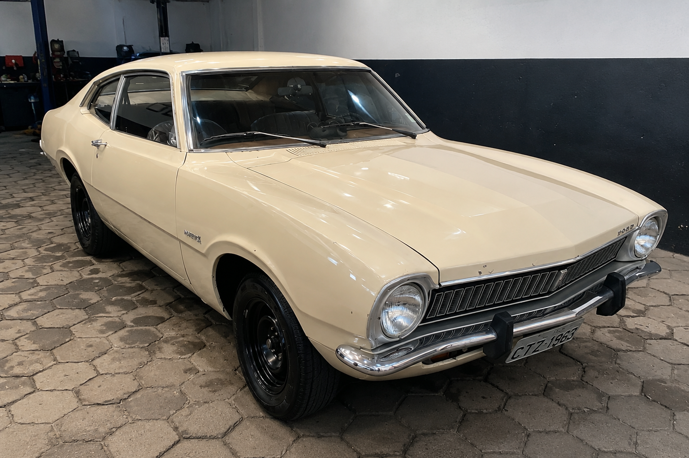

# Direção Hidráulica no Ford Maverick OHC

Documentação da adaptação de direção hidráulica no meu Ford Maverick equipado com motor OHC 2.3.

O objetivo deste projeto é construir uma direção hidráulica confiável, utilizando peças facilmente encontradas no mercado, documentando todas as etapas, dificuldades e soluções adotadas.

## 📋 Índice
- [Sobre o projeto](#sobre-o-projeto)
- [Situação atual](#situação-atual)
- [Diário de bordo](#diário-de-bordo)
- [Componentes](#componentes)
- [Custos](#custos)
- [Aprendizados e dificuldades](#aprendizados-e-dificuldades)

---

## Sobre o projeto

### Objetivos
- Compartilhar toda a adaptação;
- Registrar as peças utilizadas;
- Documentar medidas e modificações;
- Facilitar futuras manutenções;
- Servir de referência para outros proprietários de Maverick OHC.

---

## Situação atual

- Compra das peças:
- ✅ Caixa de direção adquirida
- ✅ Bomba hidráulica adquirida
- ✅ Polias duplas bomba d'agua e vira brquim 
- ⏳ Reservatório
- ⏳ Projetar o suporte da bomba
- ⏳ Projetar as correias (AC + DH)
- ⏳ Alterar coluna de direção
- ⏳ Mangueiras

---

## Diário de bordo

> Registro cronológico do andamento do projeto. Cada entrada nova entra no topo desta seção.

### Julho/2026 — Início do projeto
- Início da documentação do projeto
- Compra da caixa de direção hidráulica (Omega/Suprema, recondicionada)
- Compra da bomba hidráulica (Volkswagen Santana, nova)
- Compra da Polia dupla da bomba d'dagua
- Compra da Polia dupla do vira brequim
- Compra do braço pitman do omega suprema (não veio com a caixa) 

<!-- Próxima entrada: adicione aqui em cima, seguindo o modelo:

### Mês/Ano — Título curto da etapa
- O que foi feito
- Dificuldades encontradas (se houver)
- 
- Próximos passos

-->

---

## Componentes

- Caixa de direção hidráulica Chevrolet Omega/Suprema
- Bomba hidráulica Volkswagen Santana
- Reservatório (a definir)
- Mangueiras sob medida
- Suportes fabricados artesanalmente
- Polias adaptadas

---

## Custos

> O objetivo desta tabela é registrar o custo real da adaptação, facilitando o planejamento financeiro e servindo como referência para outros proprietários de Maverick.

| Item | Modelo | Valor (R$) | Situação |
|------|--------|-----------:|----------|
| Caixa de direção | Omega/Suprema (recondicionada) | 1200,00 | ✅ Comprado |
| Bomba hidráulica | Volkswagen Santana (nova) | 560,00 | ✅ Comprado |
| Polia dupla da bomba d'dagua | grupo de peças 4x4 | 230,00 | ✅ Comprado |
| Polia dupla do vira brequim | ML | 399,00 | ✅ Comprado |
| Braço pitman do omega | ML | 129,00 | ✅ Comprado |
| Reservatório | GM | — | ⏳ Pendente |
| Suporte da bomba | Fabricação própria | — | ⏳ Pendente |
| Revisão da caixa | Oficina especializada | XXX,XX | ⏳ Pendente |
| Correias | — | — | ⏳ Pendente |
| Mangueiras hidráulicas | — | — | ⏳ Pendente |
| Conexões | — | — | ⏳ Pendente |
| Óleo da direção | ATF | — | ⏳ Pendente |
| Alterar coluna de direção | — | — | ⏳ Pendente |

### Total investido

**R$ 2.518,00**

---

## Aprendizados e dificuldades

> Espaço para registrar problemas encontrados e como foram resolvidos — útil para quem for replicar o projeto depois.

<!-- Exemplo de como preencher:

### [Tema da dificuldade]
**Problema:** descreva o que não funcionou como esperado
**Solução:** o que foi feito para resolver

-->

---

**Última atualização:** Julho/2026
